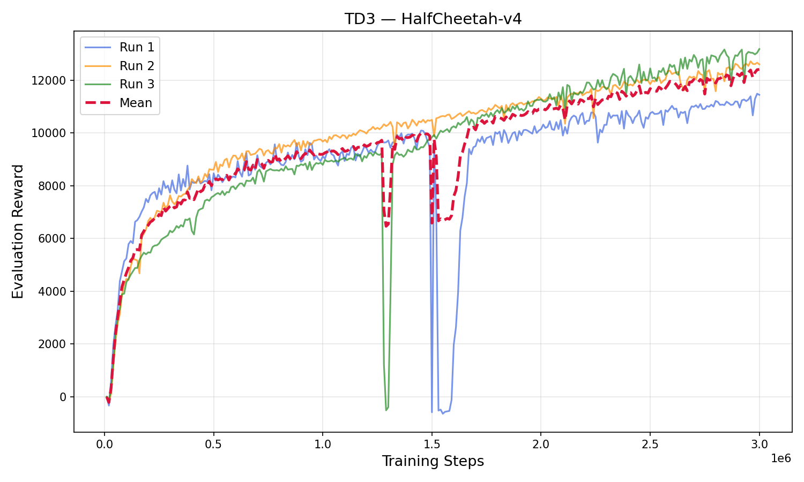
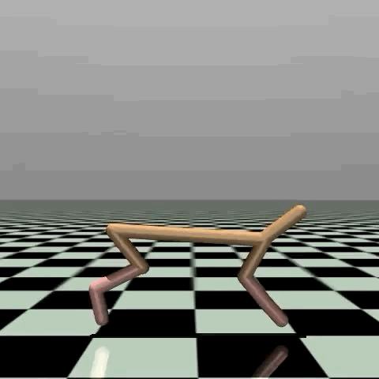

# TD3 Continuous Control with MuJoCo

Implementation of **Twin Delayed Deep Deterministic Policy Gradient (TD3) from scratch in PyTorch**, trained and evaluated on continuous-control simulation environments.

## Overview

This project explores reinforcement learning for continuous control using **TD3**, without external RL libraries.

The agent was trained and evaluated on:

* **InvertedPendulum-v4**
* **HalfCheetah-v4**

Experiments focused on convergence, training stability, hyperparameter selection, and performance across multiple random seeds.

## Key Features

* TD3 implemented **from scratch in PyTorch**
* Twin Critic networks
* Target Policy Smoothing
* Delayed Policy Updates
* Experience Replay
* Multi-seed evaluation
* Hyperparameter experiments
* GPU training with **Slurm**
* Training checkpointing and recovery

## Results

### InvertedPendulum-v4

Reached the maximum reward of **1,000** across all three independent runs.

### HalfCheetah-v4

Final evaluation:

| Seed |    Reward |
| ---- | --------: |
| 42   | 12,602.26 |
| 55   | 11,445.77 |
| 68   | 13,182.54 |

**Mean: 12,410.19 ± 721.92**

## Experimental Work

Experiments included comparisons of:

* Learning rates
* Batch sizes
* Network dimensions
* Initial exploration periods
* Training duration

Long-running experiments were executed using **Slurm job arrays**, with checkpointing support for resuming interrupted training.

## Tech Stack

**Python · PyTorch · Gymnasium · MuJoCo · NumPy · Slurm · GPU**

## Repository Structure

* `td3_agent.py` — TD3 implementation
* `train.py` — training pipeline
* `eval.py` — model evaluation
* `hp_search_*.py` — hyperparameter experiments
* `results/` — learning curves and experiment results
* `videos/` — trained agent demonstrations
* `REPORT.md` — detailed experimental analysis

## Results

### HalfCheetah-v4

**Mean final reward: 12,410.19 ± 721.92**

### InvertedPendulum-v4

**Final reward: 1,000 across all 3 seeds**

🎥 [Watch trained InvertedPendulum agent](videos/InvertedPendulum-v4-episode-2.mp4)

